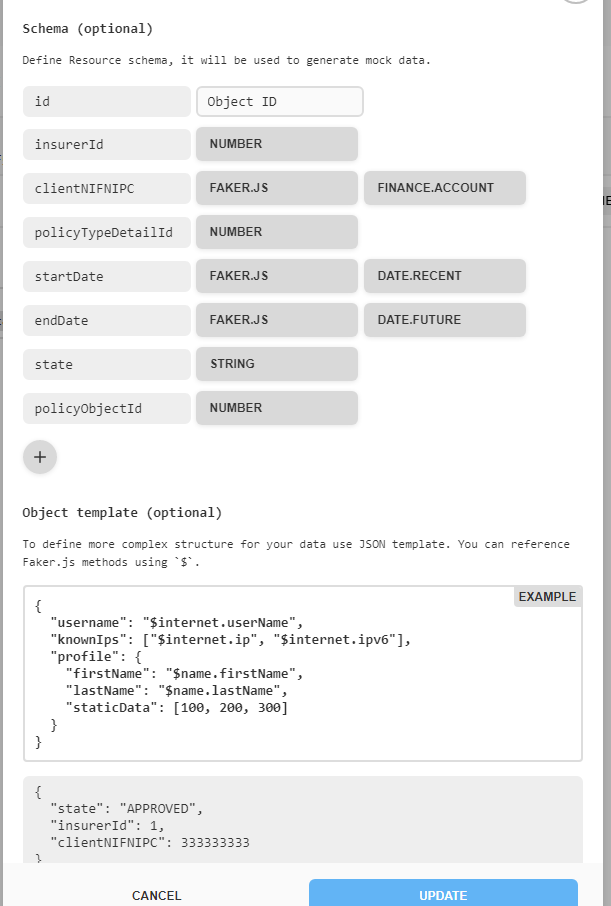
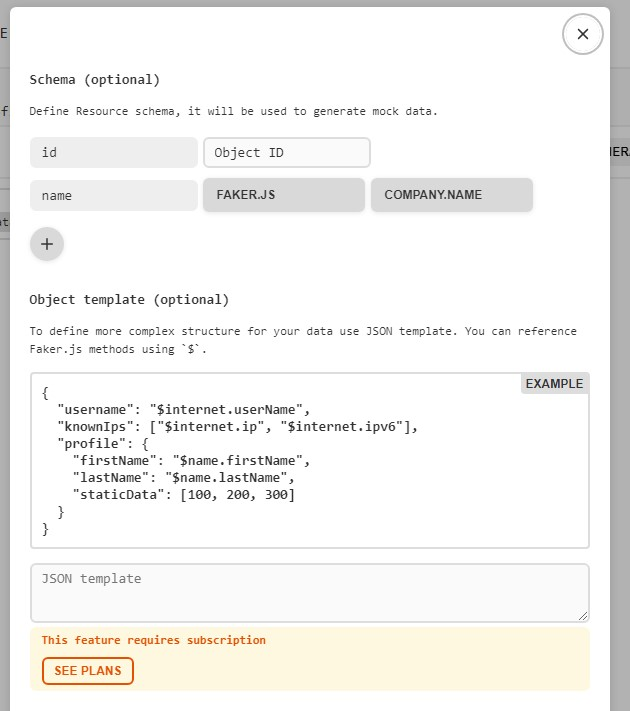
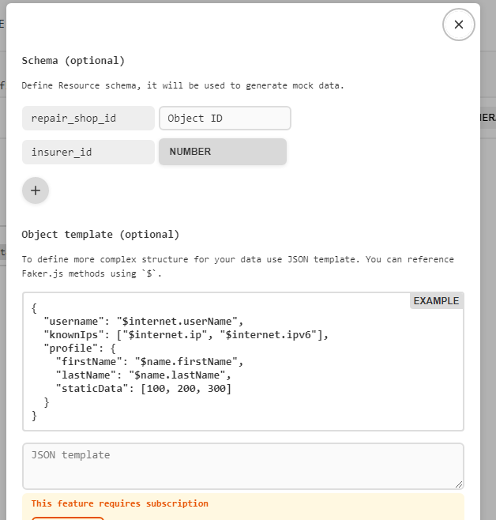
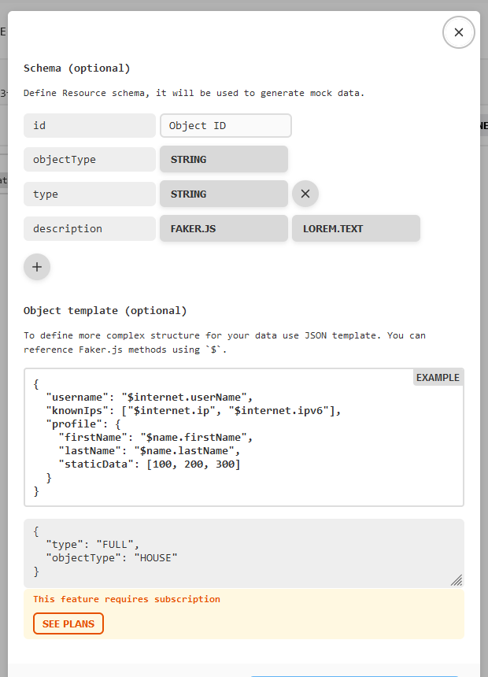
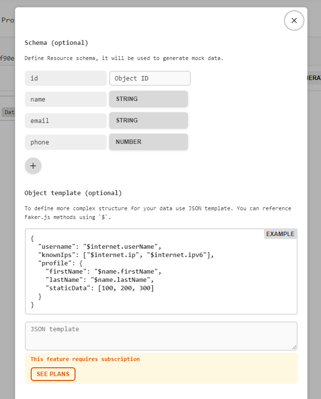
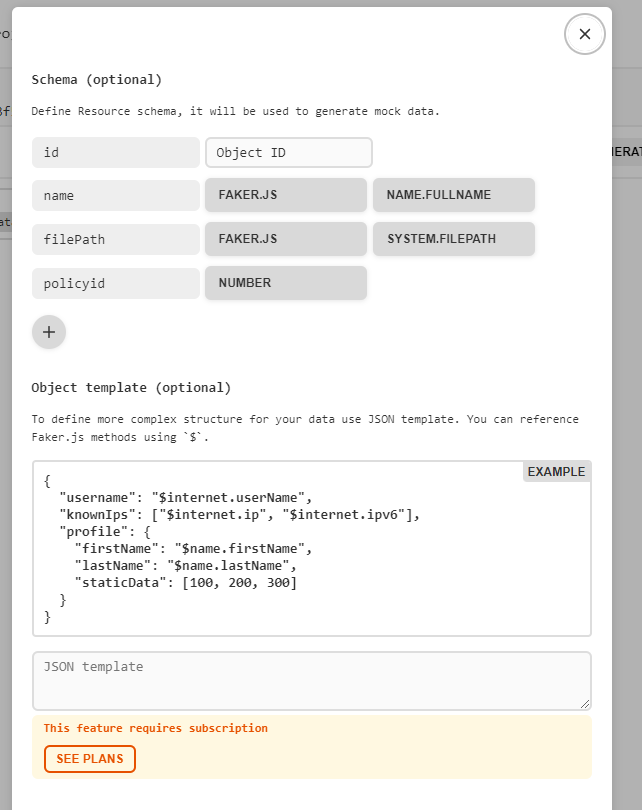

# MOCK API

Usada para simular dados externos.

Policies:



Insurers:



Insurer_repair_shops:



Policy_type_details:



Repair_shops:



Policy_objects:



# Wildfly + PostgreSQL with Docker & Docker Compose

## Setup

1. Copy the .env.example file to a .env file:
   
   ```bash
   $ cp .env.example .env
   ```

Make the adjustments you need, to match your needs.

2. Start the containers
   
   ```bash
   $ docker compose up -d
   ```

## Stoping / Pausing / Restarting the containers

Please, check the documentation for more useful command tips [here](https://docs.docker.com/compose/reference/)

## How to clear everything from your Computer

To stop and remove all the containers, images, volumes and network, run:

```bash
$ docker compose down --rmi all --volumes
```

## Alternative: remove only local (custom) images:

```bash
# Only removes the custom wildfly image, if you need to rebuild it again.
$ docker compose down --rmi local
```
